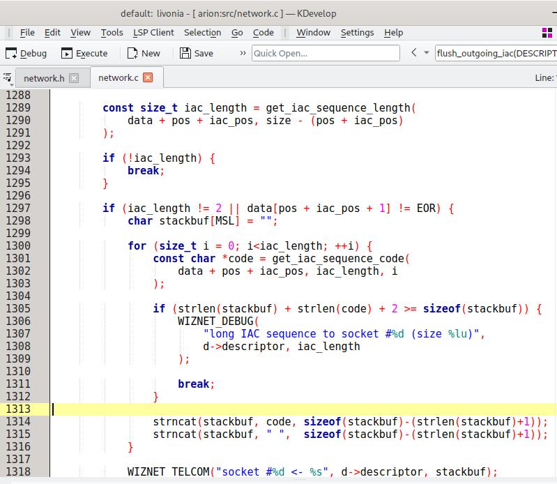

# Code::Blocks Color Theme for KDevelop ##########################################

Since [KDevelop](https://kdevelop.org/) comes with a set of built-in color themes
that are dissatisfactory to my taste, I decided to copy the code highlighting and
style configuration from [Code::Blocks](https://www.codeblocks.org/) and compile a
theme file that could be imported into the KDevelop IDE.

## The Code::Blocks C&C++ Theme ##################################################

This code highlighting theme is compatible with the C and also the C++ programming
language. Below is a screenshot depicting how the theme makes C code appear in the
KDevelop IDE.

The _codeblocks.theme_ file itself is [here](codeblocks.theme).

# License ########################################################################

The contents of this repository have been authored by Erich Erstu and are released
under the [MIT](LICENSE) license.
