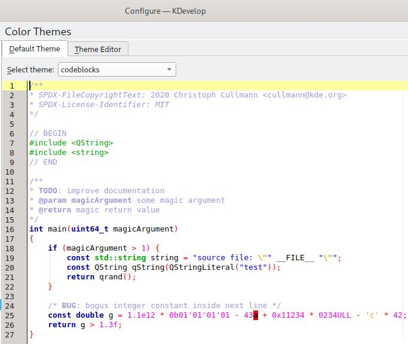

# Custom Color Theme for the KDevelop IDE ########################################

Since KDevelop IDE comes with a rather unpleasant set of color themes, I decided
to copy the code highlighting configuration from the Code::Blocks IDE and compile
a theme file that could be imported into KDevelop. **Pull requests are welcome.**

## The Code::Blocks C Theme ######################################################

This code highlighting theme is compatible with the syntax of the C programming
language. Below is a screenshot depicting how this theme makes the code appear in
the KDevelop IDE.

The _codeblocks.theme_ file itself is [here](codeblocks.theme).

# License ######################################################################

The contents of this repository have been authored by Erich Erstu and are released
under the [MIT](LICENSE) license.
